# Cocktail
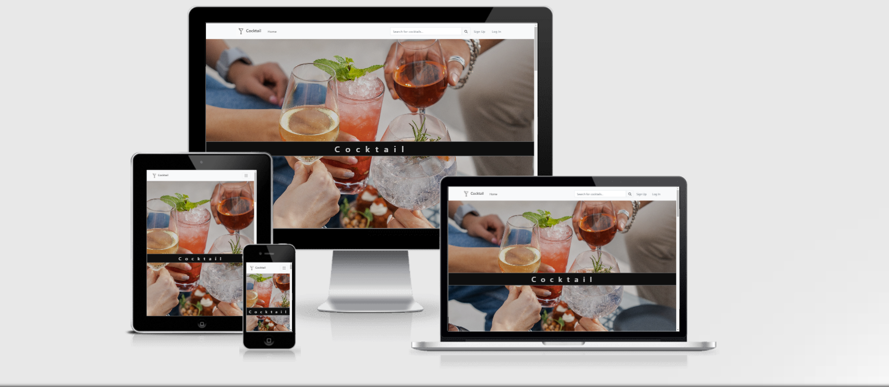


Cocktail is a website dedicated to alcoholic and non alcoholic beverages mixes in the form of a blog post where users can interact. 
When registered and logged in, users can comment, like and view recipes and also share their own cocktail recipes with others. 

This website is designed to fulfill the full stack framework milestone project IV requirements of the Code Institute course, being built in Django using Python, JavaScript, CSS and HTML.

View the live website on [Heroku](https://cocktail2022.herokuapp.com/)

Note: To open any links in a new tab, press CTRL + Click

---------------------------------------------------------------------------------------------------

## User Experience Design (UX)

### Strategy Plane

With the core UX principles in mind I started with the outline of the website by firstly identifying target audience and the needs of the enduser.
In the brainstorming phase I focused on answering  questions like "What type of content/functionality is crucial on the website?", "What type of content/functionality would be nice, but not essential?".
To create a comprehensive and appealing website I researched other recipe websites content and structure. 
The overview of how the competition looks like allowed me decide what features and functionalities would be necesary for my own project. 

Next steps were whireframing the website's design and create the database scheme. Using the Agile principles, during development the database scheme and whireframes suffered modifications. Therefore, the ones you will find in the README.md file are the latest versions.


*The typical user for the website would be someone who:*

- is most likely an adult passionate about mixing alkoholic and nonalkoholic drinks.
- Is looking to expand their knowledge in this area
- Is willing to share his/her own recipes 
- Is willing to offer his/her tips and/or impressions to other users


*The users visiting the website are looking for:*

- A wide range of cocktail recipes from all around the world
- Browse cocktail recipes
- Interacting with the site content by creating a personal account
- Storing all their recipes and access just the one they when they want to
- Writing reviews for the cocktails they have made/tried 


*The SuperUser has to be able to:*

- Approve cocktail recipe uploads and comments
- Filter through recipes, comments, and users to ease control of the site


*Site Goals:*

- To provide users a single place to find all the above 
- To have  intuitive controls and layout
- Wide compatibility with every Browsers and Devices.
- Enables its users not only to read, but to create, edit and delete content


*Site Owner Goals:*

- To provide the user with a professional web application
- Connect people who are interested in cocktails
- Inspire other people to have a colorful way enjoying their free time
- To encourage users to register and activate their profile


### EPICS & User Stories

The **Agile** methodology was used to plan the project and [Github](https://github.com), the tool to demonstrate it.
The Project Kanban Board can be seen here -  <a href="https://github.com/users/ANaRobe/projects/8/views/1?layout=board" target="_blank"> Cocktail Project </a>

Through the use of the Kanban board in the projects view in Github, the project was divived into a few different sections:
* To Do
* In Progress
* Done

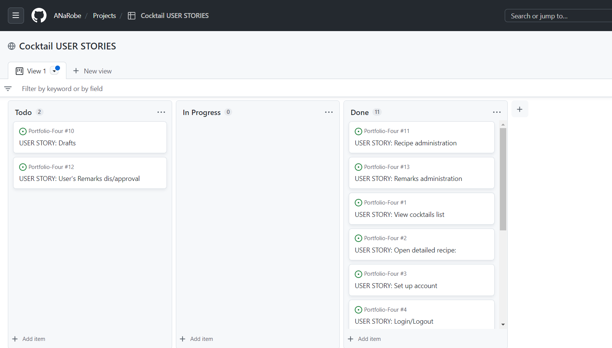

*Projects* were used to divide the project into three iterations with a simple Kanban board.
*Milestones* were used to create Epics with a custom template
*Issues* were used to create User Stories with a custom template. Eash user story is clearly described with a title, statement, acceptance criteria and tasks.They were there not only to record User Stories but also used to FIX, UPDATE and record DOCUMENTATION updates as well.
Each user story was linked to an Epic and placed within one of three Iterations. 

As it can be notice, two stories remained undone. According with the Agile principles, during development I have found myself in the position to try to implement a functionality that would not serve the user experience as I expected. Morover it would interrupt the flow of user interraction if the approval would have been at the end implemented. Therefore, the tickets will remain in stand by till othe decision will be made.
Until other automated  method will be chosen, the admin will have to manualy delete the content which breakes the website's guidelines.


EPIC| ADMIN

As a site admin I can CRUD drafts of recipes so that I finish them later
As a site admin I can CRUD recipes so that I can manage the data at any given time
As a site admin I can manage user's comments so that I can I disaprove the ones breaking the website guidelines
As a site admin I can CRUD reviews to cocktail posts so that I open conversations between the users 


EPIC | CONTENT DISPLAY

As a user I can view a paginated list of cocktails so that I can choose what I will mix
As a user I can click on an item in the list so that I explore the entire cocktail recipe and its comments


EPIC | ACCOUNT

As a user I can make my own account so that I can CRUD myself cocktail recipes and reviews
As a registered user I can login and logout of the site so that I can CRUD myself cocktail recipes and reviews


Epic | LIKES & REVIEWS

As a user I can like/unlike posts so that I can share my preferance regarding certain cocktails
As a logged-in user I can review a recipe so that I can interact with the other users
As a logged-in user I can CRUD my own cocktail recipes and reviews so that I can be in charge of my content 


Epic | BROWSING

As a logged-in user user I can search cocktails by title and ingredients so that I comfortably find the right one
As a logged-in user I can see a paginated list of the cocktails I liked so that I keep track with my favourites


### Scope Plane

A scope was defined to identify what needed to be done to align features with the strategy previously defined. Due to the imbalance of scores above, there will be some trade-offs. The was broken into these categories:

Content Requirements

The UX must address these:
- A comprehensive list of recipes.
- A comprehensive set of instructions with ingredients to follow.
- A list of all comments made on a recipe.

The UX should accommodate these:
- Easy navigation of the site.
- Ability to comment and like recipes.

## Design

The site employs a simple UI, with many standard UI components already familiar to the user and little to distract from the content itself.
Wireframe sketches were drawn up in Balsamiq. These reflect basic layout considerations rather than aesthetics.

### Logo
The logo, which is situated on the Nav Bar was created in Paint and meant to have a minimalistic style. The logo also acts as a link to take the user back to the home page.


### Color scheme

The color scheme was chosen as it feels clean and stylish in order to match any style of  cocktail could be introduced to the users. At the same time, it is both visually unintimidating and easy on the eye. The button colors are consistent throughout the app to maintain consistency and increase the intuitiveness of the page.


### Imagey

The *Hero Image* has the purpose to greet the user and instantly provide the website's purpose, being static. 
The rest of the images will be uploaded by various users.


## Structure Plane

### Logic Flow Chart

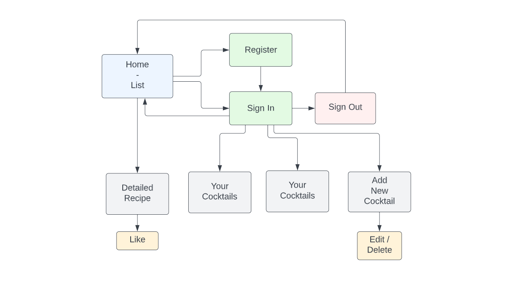

### Wireframes

Site moc-ups were designed using Balsamiq wireframes. The focus was on defining the basic layout structure of the app and identifying how displays would change on different screen sizes such as mobile, tablet and larger screens.
 

#### Desktop

- [Home Page](documentation/images/whire-home.PNG)

- [Cocktail Detail](documentation/images/whire-cocktail.PNG)

- [My Cocktails](documentation/images/whire-mobile-mycocktails.PNG)

- [My Favourites](documentation/images/whire-favourites.PNG)

- [Searched Cocktail](https://balsamiq.cloud/s3pzm93/pvfw80q/r61AA/bE3DE)

- [Sign Up](documentation/images/whire-signup.PNG)

- [Log In](documentation/images/whire-login.PNG)

- [Log Out](documentation/images/whire-logout.PNG)

##### Mobile

- [Home Page](documentation/images/whire-mobile-home.PNG)

- [Cocktail Detail](documentation/images/whire-mobile-cocktail.PNG)

- [My Cocktails](documentation/images/whire-mobile-mycocktails.PNG)

- [My Favourites](documentation/images/whire-mobile-myfavourites.PNG)

- [Sign Up](documentation/images/whire-mobile-signup.PNG)

- [Log In](documentation/images/whire-mobile-login.PNG)

- [Log Out](documentation/images/whire-mobile-logout.PNG)

---------------------------------------------------------------------------------
## Information Architecture

### Database Models

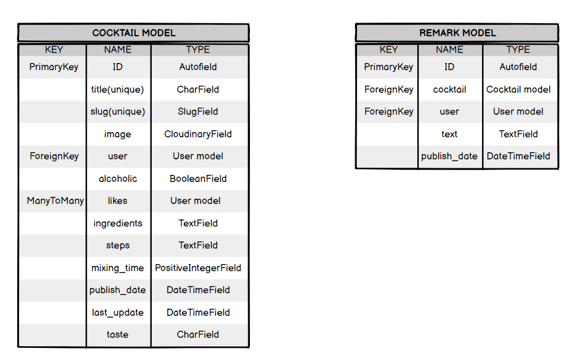

-----------------------------------------------------------------------------------
### Features

* Existing Features


*Logo* 

 * Displayed on every page for easy navigation, the user can click it to go back to the home page. 


*Nav-Bar* 

* Displayed on every page for consistency and easy navigation through the site map.

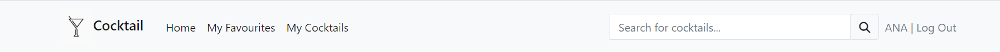


*Search Form*

* The user can search through the database by the cocktail's name or by ingredients.

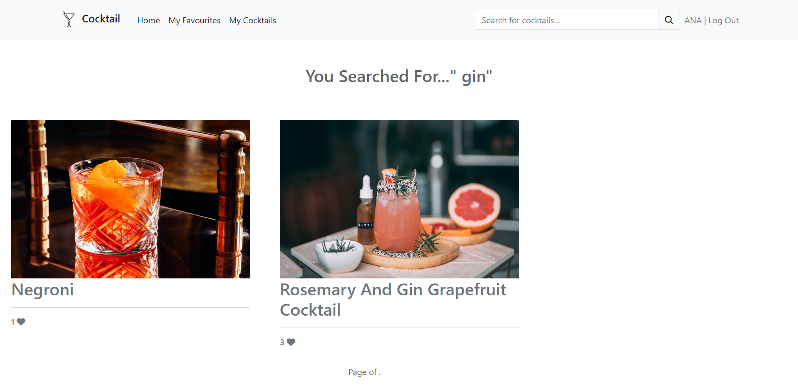


*Footer*

* Placed at the bottom of each page, displayes icons to social media accounts. By clicking them, a new separate page will open in order not to interfere with the actual website surfing.


*Cards* 

* paginated by six,they hold information of the cocktail recipe title, likes and an image. When an image was not uploaded by the user who posted a certain cocktail recipe, a placeholder image will be displayed on the card.

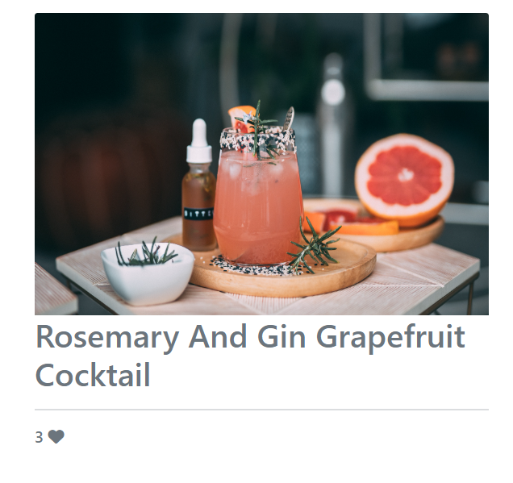

*Add Button*

* A call to action button is clearly visible to the logged in user to 'Add Cocktail' and open a new Form recipe with just one click.


*Recipe Form*

* Users who holds an account and are logged in can access the Form and edit/delete their own recipes by manipulating information in all the fields.

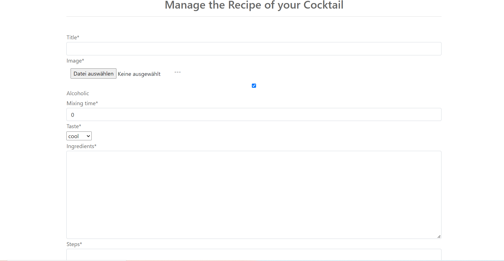

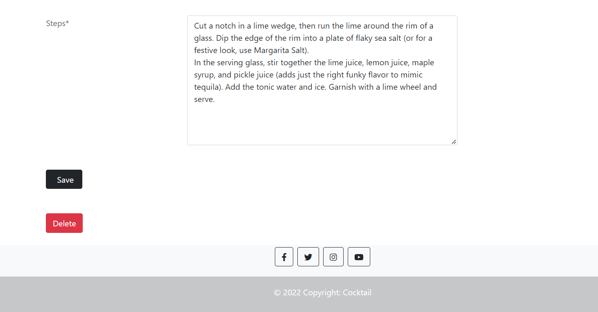


*Remark Form* 

* It can be found underneath each cocktail recipe when fully displayed. Logged in users can comment recipes, and also delete their own comments.

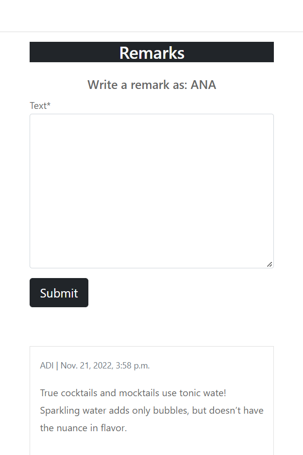


*Remarks Section* 

* All users can read all comments, the author and the date when was commented.

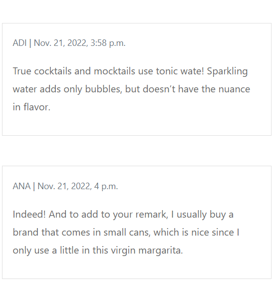


*Like/Unlike Button*

* Accompanies each cocktail recipe. Only logged in users can like/unlike. But the number of likes are  displayed for all users to see.

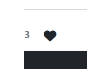


*Detailed Section* 

* Displayed when clicked on a card. Here all users (logged in or not), can view details about the cocktail. 
* This page also includes features to like and comment if you are a logged in user. 
* Only the author of a post can be redirected from this section to edit/delete his/her cocktail recipe.

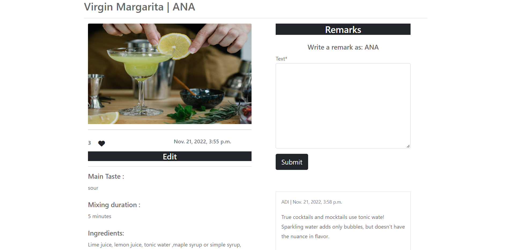


*Edit/Delete Options*

 * Only the author of the recipe can visualise the Edit button and update and/or delete their own recipes.

 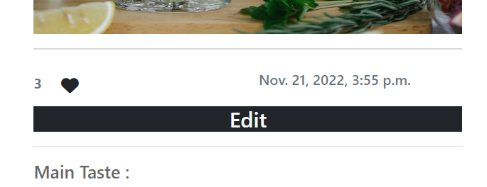


*Sign Up Section*

When wanting to register the user can make use of this formular providing a required username and password (optional email address).

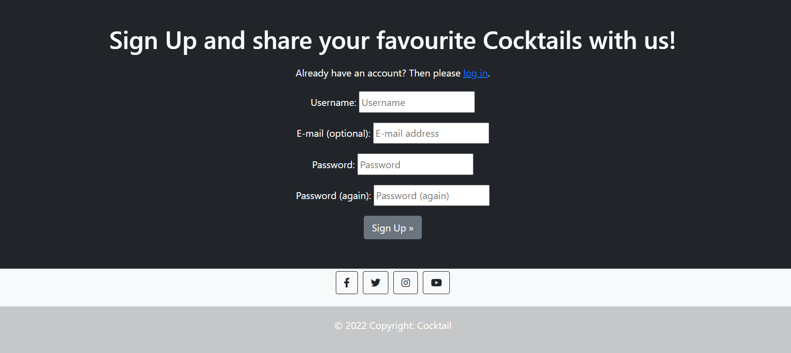


*Log In/ Log Out Section* 

The login / out section is used to login / out users with an existing account.
A message will appear once a user successfully logsin / out accordingly to the action.
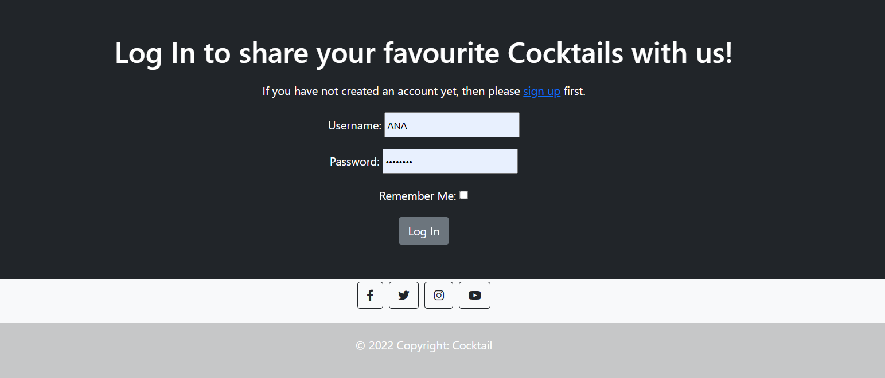

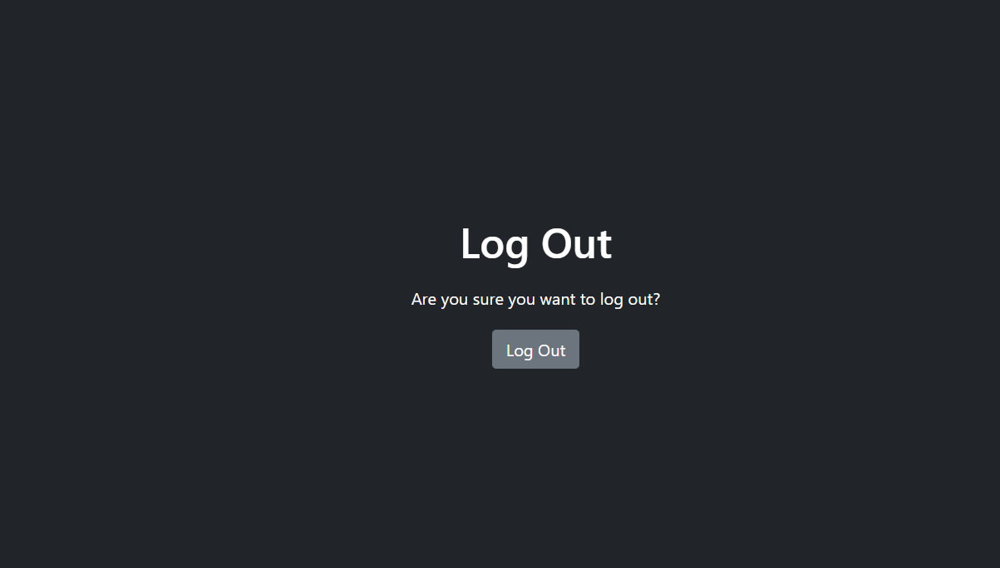

-----------------------------------------------------------------------------

## Technologies Employed

### IDE
* Gitpod

### Languages
* Python
* HTML
* CSS
* JavaScript

### Frameworks, Templates & Libraries
* Django
* Bootstrap
* Font Awesome
* Google Fonts

### Storage & Hosting
* Heroku
* Github
* Cloudinary

### Databases
SQLite3 for development
PostgresSQL for the deployed site

### Other Tools

Google Dev Tools (including Lighthouse)
Pep8online.com (to check Python code for PEP 8 requirements)
W3C Validator (to check validity of HTML and CSS)
JSHint.com (to check JavaScript)
dbdiagram.io (to produce the MongoDB ERD)

# Testing

I have included testing details in a separate document called [TESTING.md](TESTING.md)


### Django and Heroku
* To get the Django framework installed and set up I followed the Code Institute's Django Blog [Cheatsheet](https://codeinstitute.s3.amazonaws.com/fst/Django%20Blog%20Cheat%20Sheet%20v1.pdf)

# Deployment

## Deployment to Heroku

### 1. Creating the Django Project
* If development if being done locally: Activate your virtual environment
* To ensure the virtual environment is not tracked by version control, add .venv to the .gitignore file.
* Install Django and gunicorn: `pip install django gunicorn`
* Install supporting database libraries dj_database_url and psycopg2 library: `pip install dj_database_url psycopg2`
* Install Cloudinary libraries to manage static files: `pip install dj-3-cloudinary-storage`
* Create file for requirements: `pip freeze --local > requirements.txt`
* Create project:`django-admin startproject project_name .`
* Create app: `python manage.py startapp app_name`
* Add app to list of `installed apps` in settings.py file: `'app_name'`
* Migrate changes: `python manage.py migrate`
* Test server works locally: `python manage.py runserver`

### 2. Create your Heroku app
* Navigate to the Heroku website
* Create a Heroku account by entering your email address and a password (or login if you have one already).
* Activate the account through the authentication email sent to your email account
* Click the **new button** on the top right corner of the screen and select create a new app from the dropdown menu.
* Enter a unique name for the application.
* Select the appropriate region for the application.
* Click create app
* In the Heroku dashboard click on the Resources tab
* Scroll down to Add-Ons, search for and select 'Heroku Postgres'
* In the Settings tab, scroll down to 'Reveal Config Vars' and copy the text in the box beside DATABASE_URL.

From November 28th 2022, Heroku will longer support free databases, therefore migrating the database to ElephantSQL was necesary.
* For this purpose was used this [Cheatsheet](https://code-institute-students.github.io/deployment-docs/80-migrating-databases-for-heroku/) provided by Code Institute.
* In this process Converting the app to Heroku eco-dynos was also needed. The steps can be found in this [Cheatsheet](https://code-institute-students.github.io/deployment-docs/01-heroku-signup/heroku-03-converting-dynos) provided by Code Institute.

### 3. Set up Environment Variables
* In you IDE create a new env.py file in the top level directory
* Add env.py to the .gitignore file
* In env.py import the os library
* In env.py add `os.environ["DATABASE_URL"]` = "Paste in the text link copied above from Heroku DATABASE_URL"
* In env.py add `os.environ["SECRET_KEY"] = "Make up your own random secret key"`
* In Heroku Settings tab Config Vars enter the same secret key created in env.py by entering 'SECRET_KEY' in the box for 'KEY' and your randomly created secret key in the 'value' box.

### 4. Setting up settings.py

* In your Django 'settings.py' file type:

 ```
 from pathlib import Path
 import os
 import dj_database_url

 if os.path.isfile("env.py"):
  import env
 ```
* Remove the default insecure secret key in settings.py and replace with the link to the secret key variable in Heroku by typing: `SECRET_KEY = os.environ.get(SECRET_KEY)`
* Comment out the `DATABASES` section in settings.py and replace with:
```
DATABASES = {
  'default': 
  dj_database_url.parse(os.environ.get("DATABASE_URL"))
  }`
```
* Create a Cloudinary account and from the 'Dashboard' in Cloudinary copy your url into the env.py file by typing: `os.environ["CLOUDINARY_URL"] = "cloudinary://<insert-your-url>"`
* In Heroku  add cloudinary url to 'config vars'
* In Heroku config vars add DISABLE_COLLECTSTATIC with value of '1' (note: this must be removed for final deployment)
* Add Cloudinary libraries to the installed apps section of settings.py file:
 ```
 'cloudinary_storage'
 'django.contrib.staticfiles''
 'cloudinary'
 ```
* Connect Cloudinary to the Django app in `settings.py`:
```
STATIC_URL = '/static'
STATICFILES_STORAGE = 'cloudinary_storage.storage.StaticHashedCloudinaryStorage'
STATICFILES_DIRS = [os.path.join(BASE_DIR, 'STATIC')]
STATIC_ROOT = os.path.join(BASE_DIR, 'staticfiles')
MEDIA_URL = '/media/'
DEFAULT_FILE_STORAGE =
'cloudinary_storage.storage.MediaCloudinaryStorage'
* Link file to the templates directory in Heroku 
* Place under the BASE_DIR: TEMPLATES_DIR = os.path.join(BASE_DIR,
'templates')
```
* Change the templates directory to TEMPLATES_DIR. Place within the TEMPLATES array: `'DIRS': [TEMPLATES_DIR]`
* Add Heroku Hostname to ALLOWED_HOSTS: ```ALLOWED_HOSTS =
['rhi-book-nook.herokuapp.com', 'localhost']```
*Create Procfile at the top level of the file structure and insert the following:
    ``` web: gunicorn PROJECT_NAME.wsgi ```

* Make an initial commit and push the code to the GitHub Repository.
    ```git add .```
    ```git commit -m "Initial deployment"```
    ```git push```

### 5. Heroku Deployment: 
* Click Deploy tab in Heroku
* In the 'Deployment method' section select 'Github' and click the 'connect to Github' button to confirm.
* In the 'search' box enter the Github repository name for the project
* Click search and then click connect to link the heroku app with the Github repository. The box will confirm that heroku is connected to the repository.

### 6. Final Deployment
In the IDE: 
* When development is complete change the debug setting to: `DEBUG = False` in `settings.py` 
* In Heroku settings config vars change the DISABLE_COLLECTSTATIC value to 0
* Because DEBUG must be switched to True for development and False for production it is recommended that only manual deployment is used in Heroku. 
* To manually deploy click the button 'Deploy Branch'. The default 'main' option in the dropdown menu should be selected in both cases. When the app is deployed a message 'Your app was successfully deployed' will be shown. Click 'view' to see the deployed app in the browser.

## To fork the repository on GitHub

A copy of the GitHub Repository can be made by forking the GitHub account. Changes can be made on this copy without affecting the original repository.

1. Log in to GitHub and locate the repository in question.
2. Locate the Fork button which can be found in the top corner, right-hand side of the page, inline with the repository name.
3. Click this button to create a copy of the original repository in your GitHub Account.

## To clone the repository on GitHub

1. Click on the code button which is underneath the main tab and repository name to the right.
2. In the 'Clone with HTTPS' section, click on the clipboard icon to copy the URL.
3. Open Git Bash in your IDE of choice.
4. Change the current working directory to where you want the cloned directory to be made.
5. Type git clone, and then paste the URL copied from GitHub.
6. Press enter and the clone of your repository will be created.

## Credits

### Content

Most recipes created on this site were taken from [Barschool](https://www.barschool.net/blog/cocktails-101-history-and-types).

### Media
Most images that were used on the site were taken from [Pexels](https://www.pexels.com/royalty-free-images/) and [Unsplash](https://unsplash.com/s/photos/cocktails)

### Code*
References used:

* Stack Overflow
* Django Documentation
* Bootstrap Documentation
* Summernote GitHub Docs

### Youtube tutorials:

* https://www.youtube.com/watch?v=llbtoQTt4qw&amp;ab_channel=DennisIvy
* https://www.youtube.com/watch?v=JttTcnidSdQ&ab_channel=TraversyMedia
* https://www.youtube.com/watch?v=BrQrUmIOKdU
* https://www.youtube.com/watch?v=EX6Tt-ZW0so
* https://www.youtube.com/@TechWithTim


### Projects of other fellow colleagues which inspired this website:

* https://github.com/Iris-Smok/The-Healthy-Family-PP4
* https://github.com/sherryrich/heard-it
* https://github.com/Delboy/EatMe
* https://github.com/siobhanlgorman/favoureats
* https://github.com/CluelessBiker/project4
* https://github.com/KarinOldbring/vegan-a-eat
* https://github.com/Sharpryan20/food-twisters
* https://github.com/OwenDa/portfolio-4/issues/35
* https://keto-cookbook.herokuapp.com/get_recipes

-----------------------------------------------------------------------------

## Acknowledgements

 For inpiration in general, for code and advice, I'd like to give thanks to:

* Martina Terlevic

* Kasia Bogucka


### Sources

Code Institute student template for Gitpod, where all of the tools to get started were preinstalled.

<br>

*Note that this is the very first full stack project I ever worked on. Therefore, every line of code written was guided by the Code Institute content, YouTube tutorials and other fellow colleagues websites mentioned above. The code is supposed not to be an original one, rather functional. 
Many thanks to my mentor, my cohort facilitator, CI turors and fellow colleagues who inspired this project!

