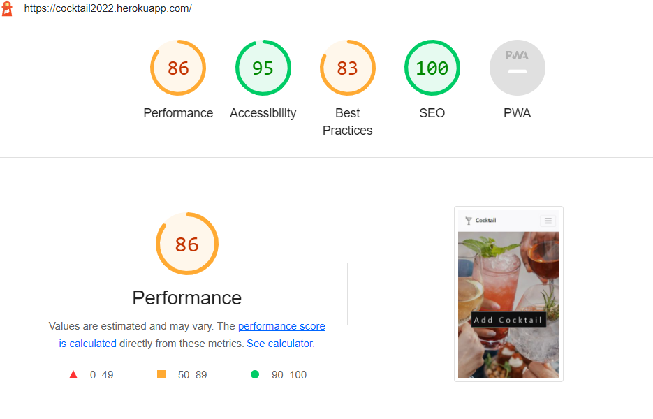
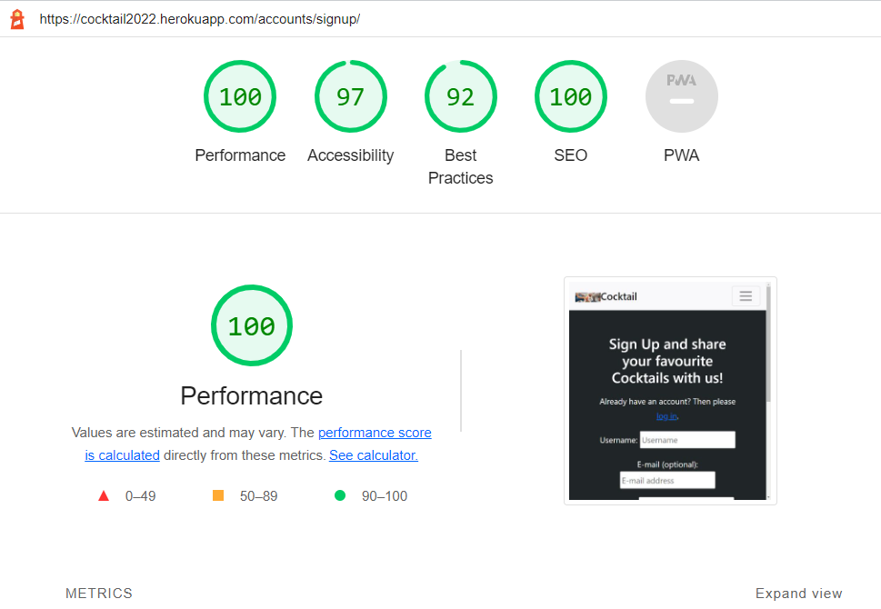
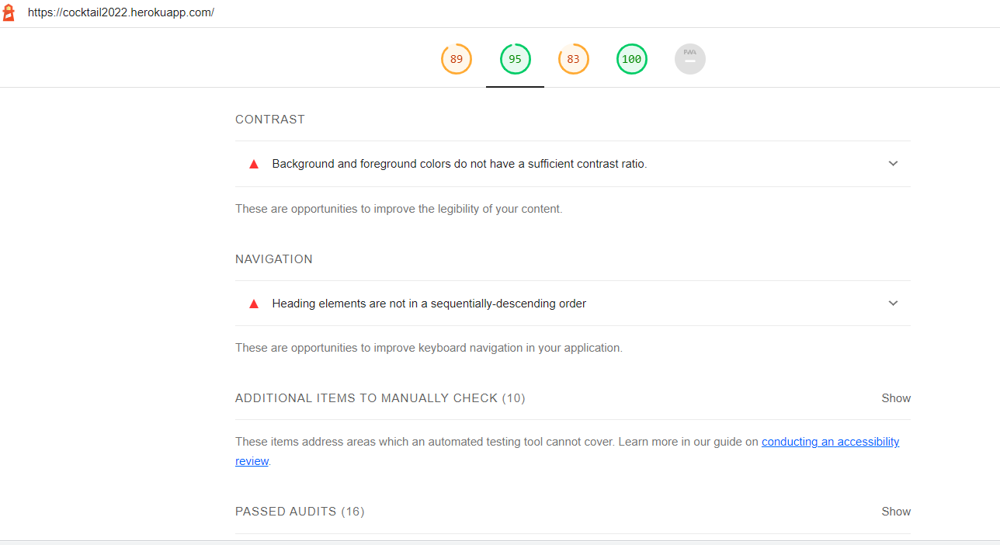
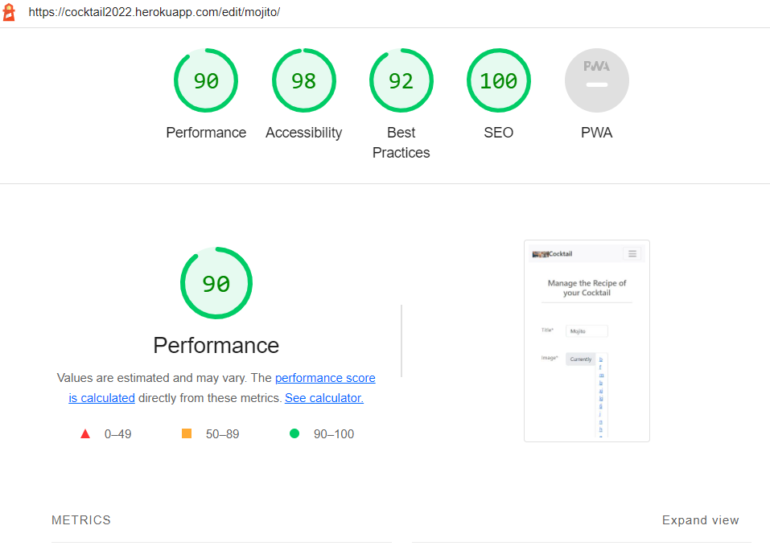
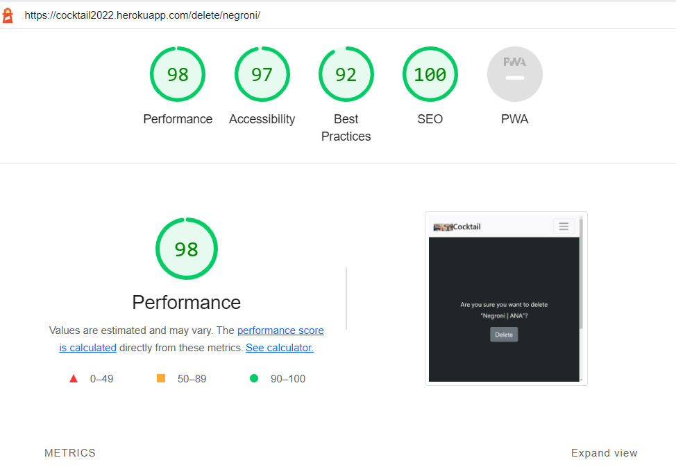

# Testing

## Validation

### Html Validation

Html validation was done with [https://validator.w3.org/nu/](https://validator.w3.org/nu/). 

 

#### **Home Page**

#### **Add Cocktail Page**

#### **Edit Cocktail Page**

#### **Log In Page**

#### **Log Out Page**

#### **Sign Up Page**

#### **Favourites**

Source code input tested

#### **Cocktail Page**

 

#### **My Cocktails Page**

Source code input tested

 

### CSS Validation

The stylesheet was validated using [https://jigsaw.w3.org/css-validator/](https://jigsaw.w3.org/css-validator/)

### Python Validation

Python code was validated using [http://pep8online.com/](http://pep8online.com/)

#### views.py

#### models.py

#### forms.py

#### admin.py

#### urls.py

### Javascript Validation

Javascript was validated using [https://jshint.com/](https://jshint.com/)

One warning of unused variable cropped up, however this variable is called elsewhere as part of EmailJS. No other errors were recorded

## Lighthouse Testing

All pages were checked on lighthouse with the results between 80% and 100% for each page on mobile and desktop.
Accessibility was impacted on a few pages. 
There were instances when the performance droped under 80% and I have tried to fix the issue by installing a CDN but that solution failed. This issue will remain to be fixed in the future.

### Home Page

#### **Desktop**

#### **Mobile**

### Favourites Page

#### **Desktop**

#### **Mobile**

### Log In Page

#### **Desktop**

#### **Mobile**

### Sign Up Page

#### **Desktop**

#### **Mobile**

### Cocktail Page

#### **Desktop**

#### **Mobile**

### My Cocktails Page

#### **Desktop**

#### **Mobile**

### Add/Edit Page

#### **Desktop**

#### **Mobile**

### Edit Page

#### **Desktop**

#### **Mobile**

### Delete Page

#### **Desktop**

#### **Mobile**

## Manual Testing

In addition to the other tests, I have conducted a manual check list for myself to carry out to make sure that everything is working as intended.

| Status | **Navigation Bar - User Logged Out**
|:-------:|:--------|
| &check; | Clicking the navbar logo loads the home page
| &check; | That the navbar shows the tabs Home, Login, Signup if the user is logged out.
| &check; | Clicking the Home tab on the navbar loads the home page
| &check; | Clicking the Login tab on the navbar loads the login Page
| &check; | Clicking the Signup tab on the navbar loads the signup page
| &check; | Clicking on the search button will bring the user to the Search page
| &check; | Not typing any character in the search field will load the page which will let him know that

| Status | **Navigation Bar - User Logged In**
|:-------:|:--------|
| &check; | Clicking the navbar logo loads the home page
| &check; | That the navbar shows the tabs Home, My Favourites, My Cocktails, user's Name and Logout  if the user is logged in
| &check; | That the navbar shows the username of the logged in user and that clicking this leads to the user My Cocktails page
| &check; | Clicking the Home tab on the navbar loads the home page
| &check; | Clicking the My Favourites tab on the navbar loads the My Favourites page
| &check; | Clicking the My Cocktails tab on the navbar loads the My Cocktails page
| &check; | Clicking the Logout tab on the navbar loads the logout page
| &check; | Clicking user's username in the navbar loads the user's My Cocktails page
| &check; | Clicking on the search button will bring the user to the Search page
| &check; | Not typing any character in the search field will load the page which will let him know that

| Status | **Footer - User Logged Out/In**
|:-------:|:--------|
| &check; | Clicking email icon loads the contact page in the wesbite
| &check; | Clicking the instagram icon loads the instagram home page in a new tab
| &check; | Clicking the facebook icon loads the facebook home page in a new tab
| &check; | Clicking the twitter icon loads the twitter home page in a new tab
| &check; | Clicking the youtube icon loads the twitter home page in a new tab

| Status | **Home Page - User Logged Out**
|:-------:|:--------|
| &check; | That the Signup text appears in the About section
| &check; | Clicking the Login button in the navbar of the home page loads the login page
| &check; | Clicking the Signup text in the navbar and the About section of the home page loads the signup page
| &check; | Clicking on a cocktail's card from the list will bring the user to the cocktail's detail page

| Status | **Home Page - User Logged In**
|:-------:|:--------|
| &check; | That an Add Cocktail button appears in the center of the hero image
| &check; | That the Add Cocktail button loads the Add Cocktail page
| &check; | Clicking on a cocktail card from the list will bring the user to the cocktail's detail page
| &check; | Typing in a incorrect URL will load the 404 error page

| Status | **My Favourites Page - User Logged In**
|:-------:|:--------|
| &check; | That the cocktails listed on the page are listed by the likes given by the user
| &check; | Clicking on a cocktail card will bring the user to the cocktail's detail page

| Status | **My Cocktails Page - User Logged In**
|:-------:|:--------|
| &check; | That the cocktails listed on the page are listed by the logedin user who posted them
| &check; | Clicking on a cocktail card will bring the user to the cocktail's detail page

| Status | **Log In Page - User Logged Out**
|:-------:|:--------|
| &check; | Clicking the sign up link above the user input loads the sign up page
| &check; | That the username input field is required
| &check; | That the password input field is required
| &check; | That if the username does not match the password the user cannot log in and user feedback is provided
| &check; | That if the correct credentials are given the user is logged in when the log in button is clicked
| &check; | That when the user is logged in they are redirected to the the home page and an alert message informs the user that they logged in successfully
| &check; |That when the user is logged in successfully their username will appear in the navbar indicating their logged in status

| Status | **Log In Page - User Logged In**
|:-------:|:--------|
| &check; | That the user cannot access the login tab from the navbar if they have logged in
| &check; | That if the user tries to type in the url of the Login page, when they are logged in they are redirected to the home page

| Status | **Sign Up Page - User Logged Out**
|:-------:|:--------|
| &check; | Clicking the log in link above the user input loads the log in page
| &check; | That the username input field is required
| &check; | That both password input fields is a required field
| &check; | That if you provide a username and password that is too similiar that the user cannot sign up and user feedback is provided
| &check; | That if your password doesn't match in both password fields, the user cannot sign up and user feedback is provided
| &check; | That if the user provides a password less that 8 character, the user cannot sign up and user feedback is provided
| &check; | That if you provide a good username and password but the email field does not contain a proper email address, the user cannot sign up and user feedback is given
| &check; | That the email input field is optional
| &check; | Clicking the Sign Up button signs the user up and logs the user in if the correct user information was provided for sign up
| &check; |That when the user signs up, they are redirected to the home page and an alert message informs the user that they sisgned up successfully
| &check; |That when the user signs up and is logged in successfully their username will appear in the navbar indicating their logged in status

| Status | **Sign Up Page - User Logged In**
|:-------:|:--------|
| &check; | That the user cannot access the signup tab from the navbar if they have logged in
| &check; | That if the user tries to type in the url of the sign up page, when they are logged in they are redirected to the home page

| Status | **Log Out Page - User Logged Out**
|:-------:|:--------|
| &check; | That the user cannot access the log out tab from the navbar if they have logged out
| &check; | That if the user tries to type in the url of the log out page, when they are logged out they are redirected to the home page

| Status | **Log Out Page - User Logged In**
|:-------:|:--------|
| &check; | Clicking the logout button logs the user out
| &check; | When the user logs out they are redirected to the home page and a message alerts the user that they have logged out
| &check; | Once the user logs out the username in the navbar is removed

| Status | **Add Cocktail Page - User Logged Out**
|:-------:|:--------|
| &check; | That the  Add Cocktail button from the Homepage is not displayed if the user is logged out
| &check; | That if the user tries to type in the url of the Add Cocktail page, when they are logged out they are redirected to the log in page

| Status | **Add Cocktail Page - User Logged In**
|:-------:|:--------|
| &check; | That the Title input field is required
| &check; | That Cocktail Image field is optional
| &check; | That Alcoholic field is by default checked and able to be unchecked
| &check; | That the Mixing time is set to 0 minutes by default and optional
| &check; | That the Main Taste is set to cool by default and can be switched between salty, sour, sweet, bitter, umami, cool, hot.
| &check; | That the Ingredients field is required
| &check; | That the Steps field is required
| &check; | That the form cannot be submitted without all the required fields and user feedback is given if a user forgets a  required field
| &check; | That none of the input fields accept empty fields
| &check; | That none of the fields accept just spaces in an input field
| &check; | That when the form is submitted a cocktail slug is automatically created from the title input fields in the form
| &check; | That when the form is submitted that if the user added an image, this is uploaded correctly and linked to the specific cocktail
| &check; | That when the cocktail is added, the user is redirected back to the Home page and a message alert informs the user that they successfully added a cocktail and can be seen as the first item on the list

| Status | **Edit Cocktail Page - User Logged Out**
|:-------:|:--------|
| &check; | That the  Edit  button from the Cocktail page is not displayed if the user is logged out or not the author of the specific cocktail
| &check; | That if the user tries to type in the url of the Edit page, when they are logged out they are redirected to the log in page

| Status | **Edit Cocktail Page - User Logged In**
|:-------:|:--------|
| &check; | That the Title input field is required
| &check; | That Cocktail Image field is optional
| &check; | That Alcoholic field is by default checked and able to be unchecked
| &check; | That the Mixing time is set to 0 minutes by default and optional
| &check; | That the Main Taste can be switched between salty, sour, sweet, bitter, umami, cool, hot.
| &check; | That the Ingredients field is required
| &check; | That the Steps field is required
| &check; | That the form cannot be submitted without all the required fields and user feedback is given if a user forgets a  required field
| &check; | That none of the input fields accept empty fields
| &check; | That none of the fields accept just spaces in an input field
| &check; | That when the form is submitted a cocktail slug is automatically created from the title input fields in the form
| &check; | That when the form is submitted that if the user added an image, this is uploaded correctly and linked to the specific cocktail
| &check; | That when the cocktail is saved, the user is redirected back to the Home page and a message alert informs the user that they successfully added a cocktail and can be seen as the first item on the list
| &check; | That the Delete button is diplayed
| &check; | That the Delete button is clicked by the author, redirects him to the Delete Cocktail Page

| Status | **Delete Cocktail Page - User Logged Out**
|:-------:|:--------|
| &check; | That if the user tries to access the delete cocktail url that they are redirected to the login page

| Status | **Delete Cocktail Page - User Logged In**
|:-------:|:--------|
| &check; | that the title of the specific cocktail and it's author is displayed 
| &check; | Clicking the Delete button redirects back to the home page
| &check; | That an alert message informs the user that they successfully deleted their cocktail
| &check; | That the cocktail is completely deleted and doesn't show up in the database or subsequently any place on the website

| Status | **Cocktail Page - User Logged Out**
|:-------:|:--------|
| &check; | That the page url is specific to that cocktail
| &check; | That the website page pulls all the correct information on that specific cocktail: cocktail image, title, mixing time, Cocktail/Mocktail , Main Taste, ingrediets, steps.
| &check; | That the heart icon for this cocktail is not clickable by the user
| &check; | That the cocktail displays the number of users who have liked this cocktail
| &check; | That the log in and sign up links in the in this text link to the appropriate log in and sign up pages
| &check; | That is displayed that the user needs to log in or signup to remark this cocktail
| &check; | That the log in and sign up links in the text load the appropriate log in and sign up pages when clicked.
| &check; | That at the bottom of the page, all the remarks for that particular cocktail are displayed correctly in order of the newest created.
| &check; | That the remarks show the name of the user who made the remark, the date and time it was created and the remark text itself.

| Status | **Cocktail Page - User Logged In**
|:-------:|:--------|

| &check; | That the page url is specific to that cocktail
| &check; | That the website page pulls all the correct information on that specific cocktail;  image, title, mixing time, Cocktail/Mocktail ,ingrediets, steps.
| &check; | That the heart for this cocktail is clickable by the user to like/unlike the cocktail.
| &check; | That the the number of likes for this cocktail is displayed next to the heart.
| &check; | That the heart turns a solid color if the user clicks the icon.
| &check; | That the heart turns back to an outline if the user clicks the icon again removing the like.
| &check; | In the remark section the remark form displays correctly
| &check; | That the text above the input field informs the user of who they are posting as (their username)
| &check; | That the remark input field is required
| &check; | That clicking the remark button will submit the remark if all the criteria are met
| &check; | That the remarks shown show the name of the user who made the remark, the date and time it was created and the remark text itself.
| &check; | That the Edit button is displayed when the user who posted the specific cocktail is viewing the page 
| &check; | That the Edit button opens the Edit Form when is clicked by the author

| Status | **My Cocktails Page - User Logged Out**
|:-------:|:--------|
| &check; | That the My Cocktails tab in the navbar cannot be accessed
| &check; | That if the user tries to access the My cocktails url that they are redirected to the login page

| Status | **My Cocktails Page - User Logged In**
|:-------:|:--------|
| &check; | That the username is in fact the username of the user currently logged in
| &check; | That the cocktails section correspond to the cocktail recipes that the user has posted
| &check; | Clicking a cocktail in the list loads the cocktail's detail page
| &check; | That the cocktail listing card shows the cocktail title, like, cocktail image and wether is Mocktail or Cocktail
| &check; | That the cocktail heart shows the number likes of the specific cocktail
| &check; | That the number of likes of a cocktail  is reflected accurately according to how the user changes their like

| Status | **My Favourites Page - User Logged Out**
|:-------:|:--------|
| &check; | That the My cocktails tab in the navbar cannot be accessed
| &check; | That if the user tries to access the My cocktails url that they are redirected to the login page

| Status | **My Favourites Page - User Logged In**
|:-------:|:--------|
| &check; | That the username is in fact the username of the user currently logged in
| &check; | That the cocktails section correspond to the cocktail recipes that the user has liked
| &check; | Clicking a cocktail in the list loads the cocktail's detail page
| &check; | That the cocktail listing card shows the cocktail title, like, cocktail image and wether is Mocktail or Cocktail
| &check; | That the cocktail heart shows the number of likes of the specific cocktail
| &check; | That the number of likes of a cocktail  is reflected accurately according to how the user changes their like
